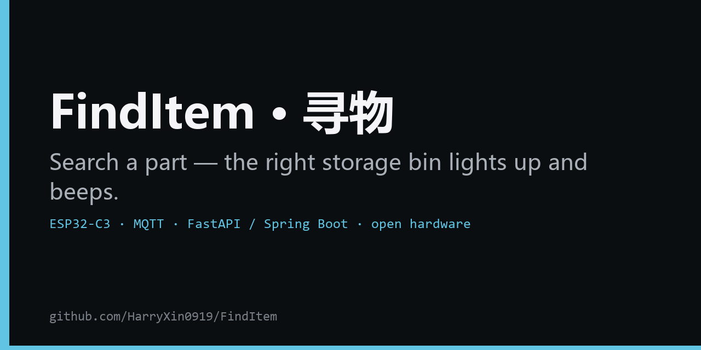
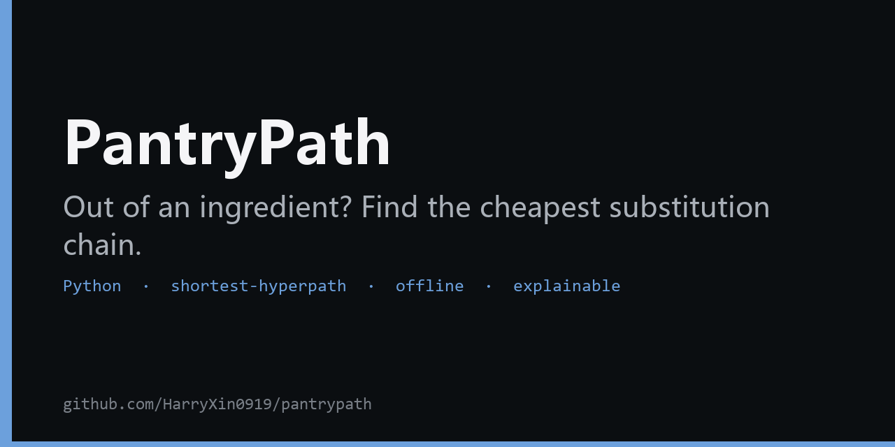
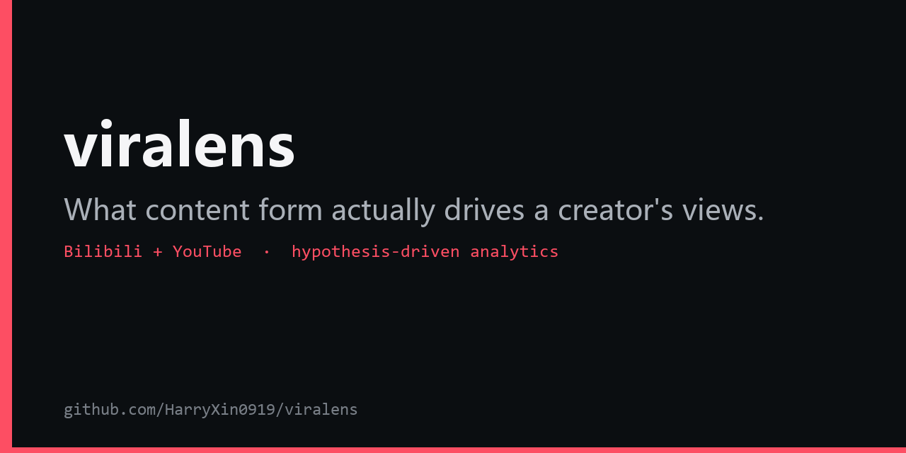
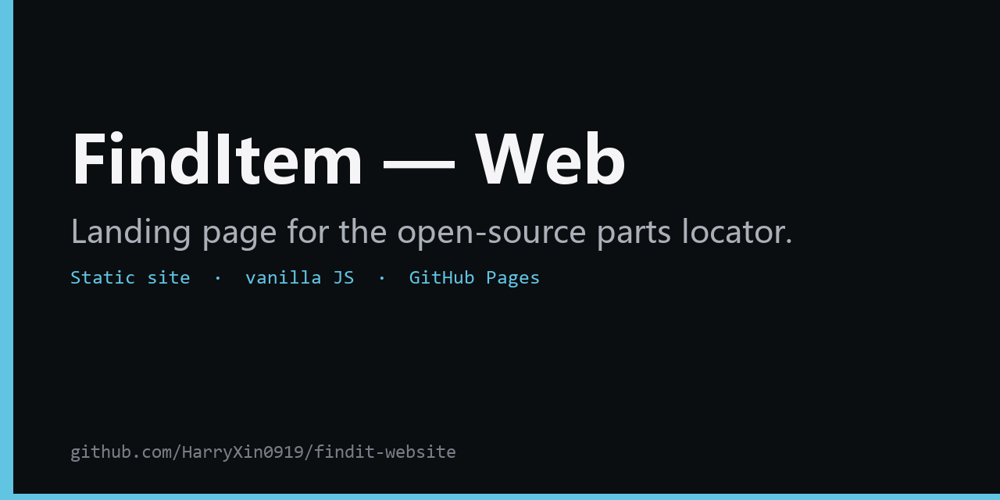

<h1 align="center">Hi, I'm Harry 👋</h1>

  High-school maker who likes turning messy real-world problems into clean code. 
  Open-source <b>hardware &amp; tools</b> · interested in physics, math, and engineering. 
  Currently: shipping the FindItem hardware project and a few small Python tools.

  
  
  
  
  
  
  

---

### 🔧 What I build

- 🤖 **Hardware / IoT** — ESP32-C3 firmware over MQTT; real devices that light up and beep
- 🐍 **Python tools** — CLIs &amp; libraries with tests, packaging, and CI
- 📊 **Data analysis** — hypothesis-driven, and honest about what the data does *and doesn't* show

### 📌 Featured projects

<table>
  <tr>
    <td>
      
    </td>
    <td>
      
    </td>
  </tr>
  <tr>
    <td>
      
    </td>
    <td>
      
    </td>
  </tr>
</table>

- **FindItem** — decentralized parts locator: search a part, the right storage bin lights up and beeps (ESP32-C3 · MQTT · FastAPI / Spring Boot)
- **pantrypath** — cheapest ingredient-substitution chain modeled as a shortest-hyperpath problem (Python · no ML, no API)
- **viralens** — hypothesis-driven analytics for Bilibili / YouTube creators
- **findit-website** — the open-source landing page for FindItem

### 📈 GitHub

  
  

  Most-used: Python · C++ (ESP32) · Java · HTML/JS — see the project cards above for the real mix.

